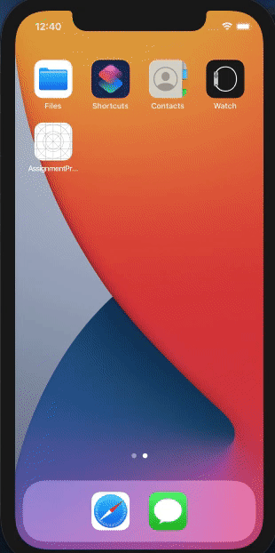

# AssignmentProjects

Date: 12/3/21

## Session: Doubt Session

1 Render Screen with following:  
* Search bar above (Search functionality is optional)
* Use categoryName as section list header 
* productName as name of the product  
* Store Selected: Text is hardcoded 
* On Cross User will go back
* Header Effect is optional
* User can select any item in the list 
* Show selected and unselected checkbox 
* Once a item is selected CONTINUE button is shown on the screen

2 Create a custom Activity Indicator using Modal and custom gif

## Output:

</img>

