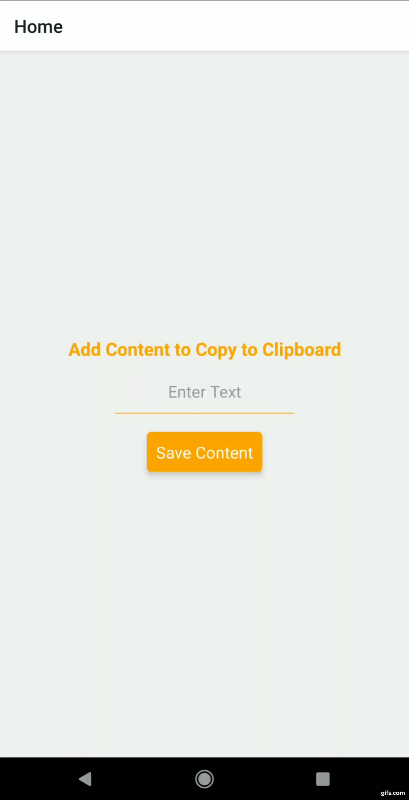

# AssignmentProjects

Date: 11/3/2021

## Session: React Native Components - 5

* Use Alert, intercept Back Press and show the text to confirm go back.
* Use Clipboard to move text from one screen to another.

### Output:
</img>