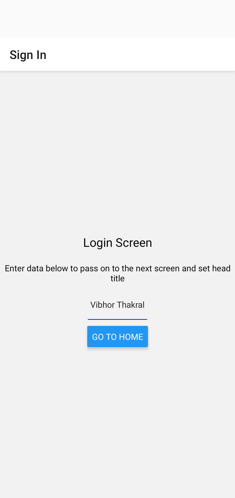
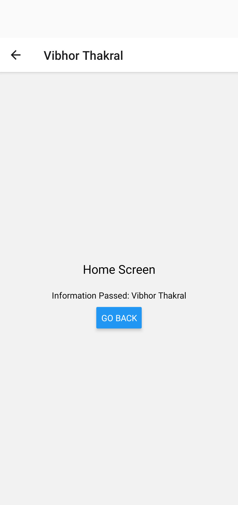
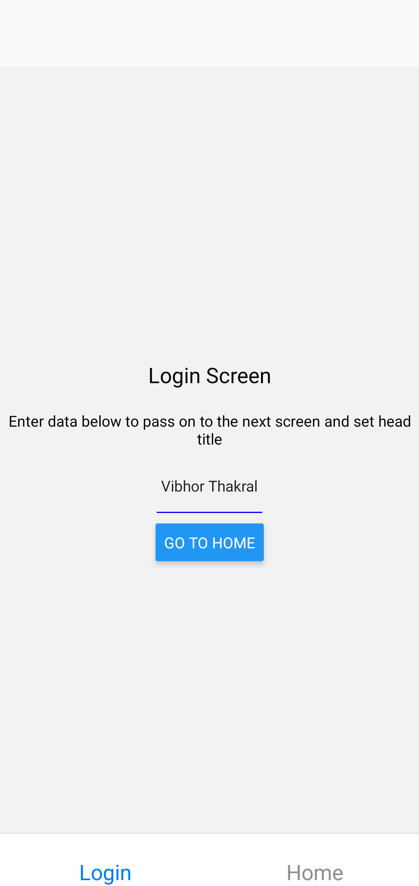
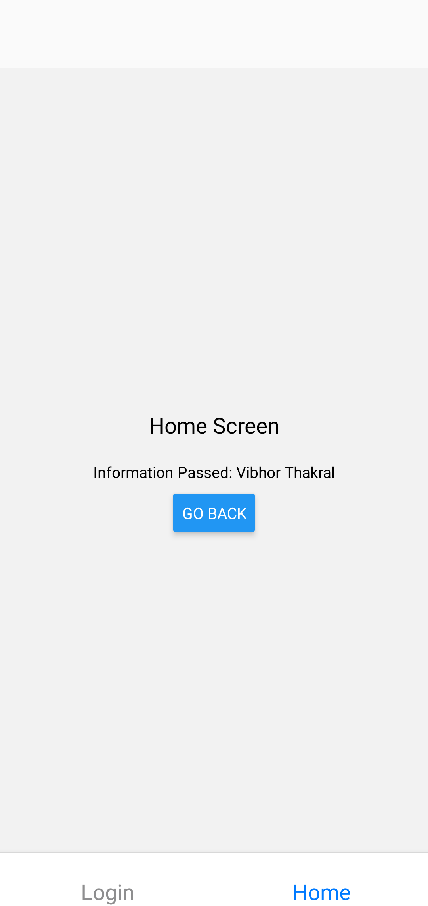

# AssignmentProjects  
Date: 5th March 2021

## Session: React-Native Navigations  
  
1. Create Stack, Tab and Drawer Navigator (optional)
2. Pass Props and Set it as header title

### <ins>How it Works: </ins>
To Run the Different Navigations change the value of isTabs in Routes.js file     

To Open the Tabs Navigation   
```js 
const isTabs = true; 
```

To Open The Stack Navigation  
```js 
const isTabs = false; 
```  
  
### <ins>Output: </ins>
</img>
</img>  
</img>
</img>  