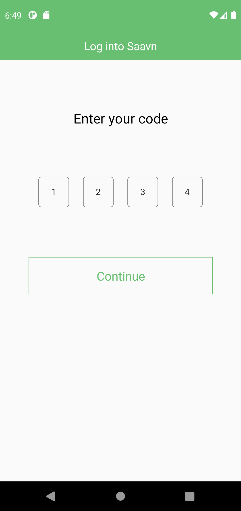
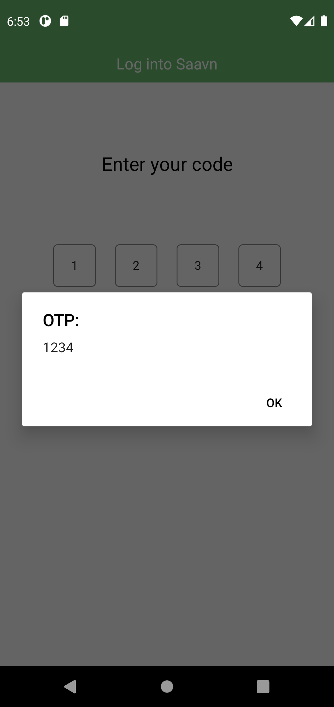
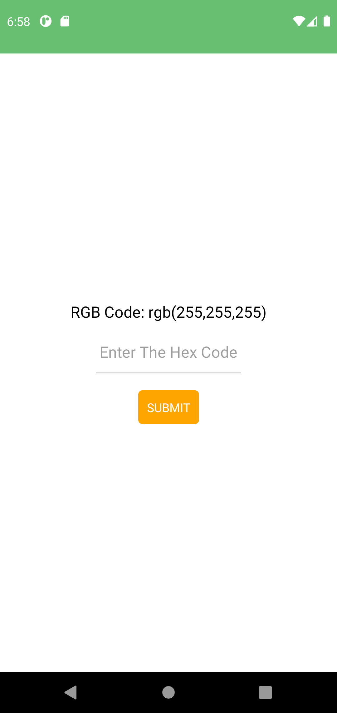
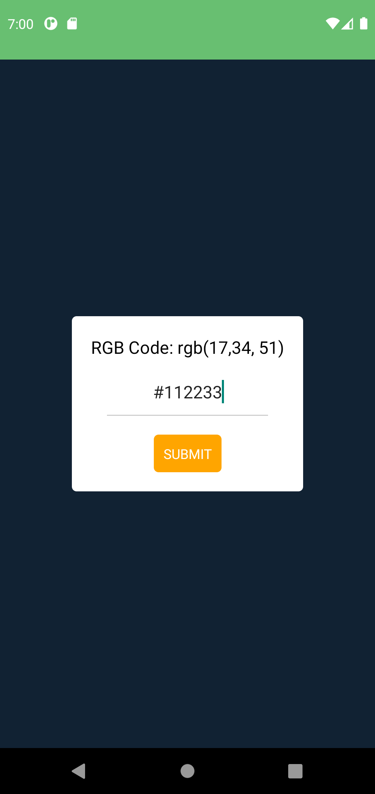
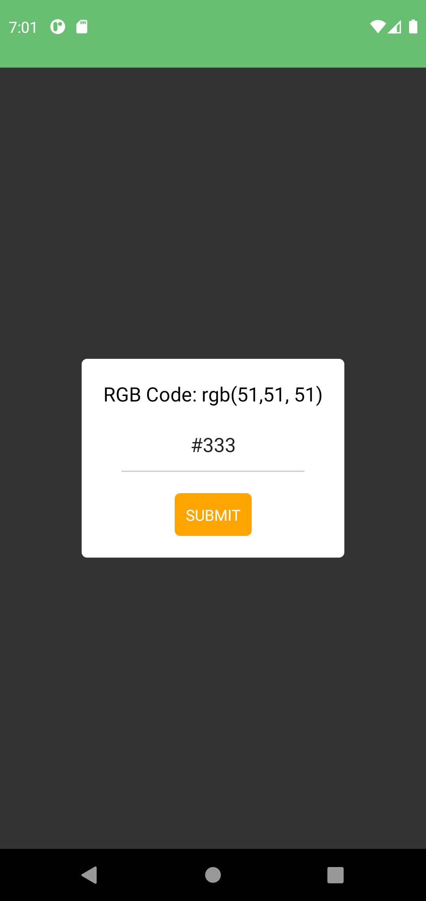

# AssignmentProjects

Date: 3rd March, 2021  
## Session: React Native Components -1  

### <ins>How to Run Programs</ins>
If you wish to run Problem A, go to index.js and change the AppRegistry code to  
```js
AppRegistry.registerComponent(appName, () => ProblemA);
```
For Running Problem B
```js
AppRegistry.registerComponent(appName, () => ProblemB);
```
similarly with Problem C, change the code to
```js
AppRegistry.registerComponent(appName, () => ProblemC);
```

### <ins>Problem A:</ins>  
Create the screen with design given in the link below alongwith background image.  
[Image](https://drive.google.com/file/d/1ot21Mo6zOgiY1gkDPyLw82FKe82eSXws/view?usp=sharing)  
  
Output:    
 
  
    
### <ins>Problem B:</ins>  
Create a text input , text and view alongwith the following steps:-
* You will input the hex code of a color, and validate that hexcode on submit.
* If it is a valid hex code convert it into RGB and show its value in the 'Text' 
* Give that RGB value as background color for the 'View'.  
  
Output:  

 
 
    
### <ins>Problem C:</ins>  
Create a image view and show activity indicator in place of image while it is loaded.  
  
Output:  

  


